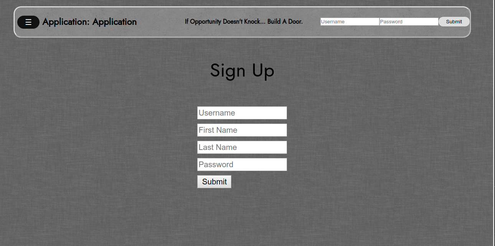
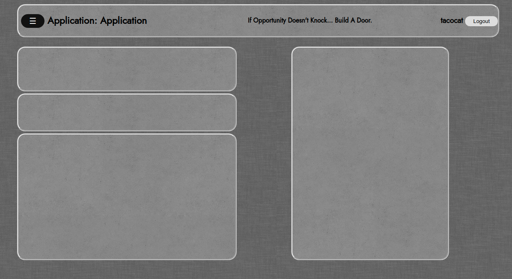
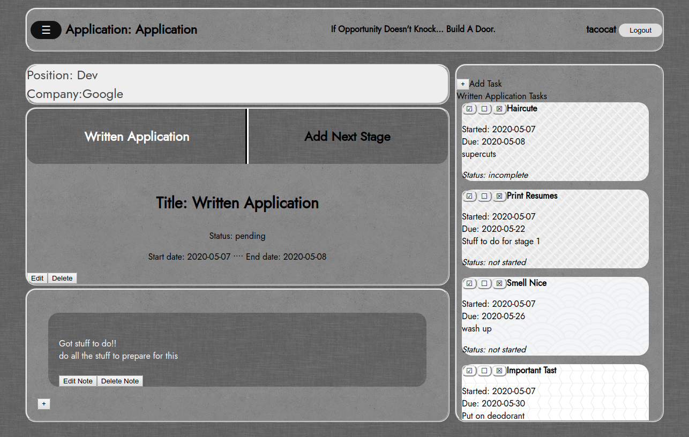

# Application Application

This Single Page Application is meant to help a job seeker keep track of their job applications. A user can create a login and add job positions to it, add stages of the job search and attach notes and a to-do list.

## Installation

If you fork or clone down this project, you should go into the folder called ApplicationApp_backend and run “rails db:migrate” and start the rails server with “rails s”. Then you’ll be able to open ApplicationApp_frontend/index.html in your browser (right click and “Open with” the browser of your choice).  The application was tested with Google Chrome. 

## Starting Out

On the main screen, you’ll find a signup form and a login form. Since it’s your first time using the application, create a new user account. Choose a username, enter your full name (as you like) and create a password. Please know that password security is not implemented at this time, so your password will be displayed and saved as clear text. There is verification when you return to your account, that checks your username and password combination, so please remember both!

After you create your login, you’ll be sent to the main body of the application. You’ll see a navigation bar at the top of the page. The ApplicationApplication logo is at the left, some inspiration is in the middle and your username and a logout button are available on the right. Next to the logo on the left, there is a hover menu. 

Below the navigation bar, you’ll find two columns. If you hover of the menu button, you’ll be offered the opportunity to Add a Position. This will open a form where you can enter the details of a position for which you are applying. Most of the details for this form can be filled with information from the job posting, but a few items are personal opinion – with the rating options and the Pros/Cons text area, you can remember how excited your are about each job posting, and enumerate benefits and limitations of the opportunity. Save that form, and you’ll be able to move on to the next part.

Once you’ve created a position, as described above, you’ll be able to access it again from the drop down menu in the navigation bar, listed by the title you give it. When you select a position, it will open a view with the position title and company visible. If you click in that field, the view will open up to show you the details. Click it again to close the expanded view.

Below that, you’ll see a field with an “Add a Stage” clickable field. If you click it, another form will open where you can add stages to your job application, ie. Written Application, Background Check, Phone Interview, Technical Interview, etc. Once you have created a stage, its title will be visible in the menu where you found the “Add a Stage” button. Click the title, and you’ll be able to add notes about the stage in the next row down, or create a to-do list to the right. 

Both notes and tasks can be created using their + buttons. Use the notes to add information like further contact information, locations, things to bring or acquire for the stage. Use the task list to keep track of things you need to prepare for your stage; tasks will be sorted by due date, soonest to latest. You’ll also notice the background of the task is correlated to its priority level. Each task has 3 buttons on the box: the check mark automatically marks the task as completed, the empty square box leads to the edit menu, and the box with the x will permanently delete the task. Please note that when you edit a task, you must specifically select the dropdown boxes or they will reset the values to the default value of the box (your high priority task could be reset to low priority). 

Notes and tasks are only available to add to specific stages of an application, not to the main body of the application, so be sure you are viewing a stage to interact with its notes and tasks. 

Keep adding to your Position, Stages, Notes and Tasks as you go through your application process. You can update the status of the position as you go, and finally mark it accepted or rejected. If you aren’t interested in seeing a position anymore, you can delete it and all of the associated stages, notes and tasks will be removed at the same time. We recommend you keep them though, so you can see all the work you’ve been doing!

When you’re finished using the app, click the logout button and your information will be removed from the web browser (but don’t worry, it’s still available on your sqlite database). Log in again with your username and password to keep updating your progress. Good luck and happy job hunting!

### Prerequisites

This project runs with a sqlite database. It has a Ruby on Rails back end, and a JavaScript/CSS/HTML front end. The project requires about 36 MB of space on your computer. 

## Future Functionality Goals

We’d like for this app to have some graphical analysis of application statuses or progress.  There are some awkward styling issues, like the balance between the task list and the positions view column of information.

## Authors
Jazz Bozner,
Christine Bumpous,
Janu Sung

## License

This project is licensed under the GNU General Public License.

## Acknowledgments

Thanks to our instructors and coaches at Flatiron School for teaching us Ruby, Rails, JavaScript and more! Nine weeks in, and we’ve come so far!

## Major Resources:
https://www.sitepoint.com/sort-an-array-of-objects-in-javascript/

https://developer.mozilla.org/en-US/docs/Web/CSS/

https://css-tricks.com/

https://www.toptal.com/designers/subtlepatterns/thumbnail-view/

https://www.w3schools.com/
